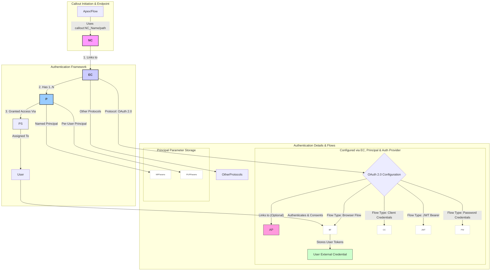

# named-credentials

Here is a Mermaid diagram illustrating the modern Named Credential framework, highlighting the relationships between components and detailing the configuration for common OAuth 2.0 flows:

**Explanation:**

1. **Callout Initiation:** Shows how Apex or Flow initiates a callout using the Named Credential URL.  
2. **Authentication Framework:** Illustrates the core relationship: Named Credential links to an External Credential, which has one or more Principals. Access to use the Principal is granted via Permission Sets/Profiles assigned to Users.  
3. **Authentication Details & Flows:**  
   * Shows that the External Credential defines the main Authentication Protocol.  
   * Zooms into **OAuth 2.0**, showing its link to an optional Auth Provider (often holding endpoints and sometimes credentials).  
   * Details the configuration for common **OAuth 2.0 Flows** (Browser/Auth Code, Client Credentials, JWT Bearer, Password Credentials), listing the key parameters and where they are typically configured (EC, Principal, or AP).  
   * Highlights the role of the **User External Credential** in storing user-specific tokens for Per-User flows like the Browser Flow.  
   * Shows where specific credentials or parameters are typically stored within **Named** vs. **Per-User Principals**.

This diagram provides a visual map of the components, their relationships, and how different OAuth 2.0 flows are configured within the modern framework.
