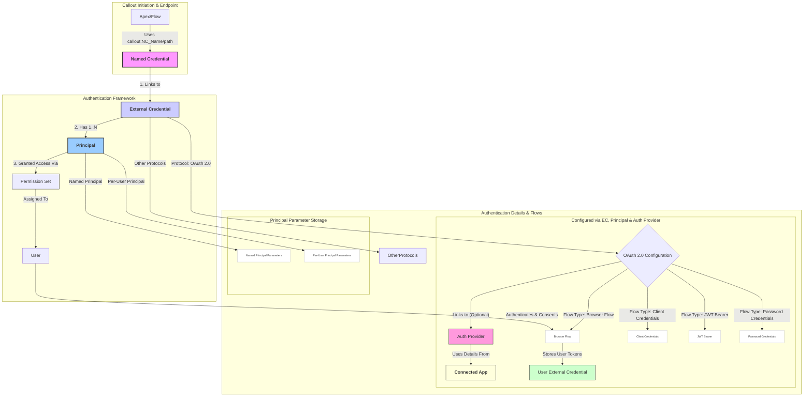

# named-credentials

A Salesforce Callout (from Apex/Flow) uses a Named Credential pointing to an External Credential for authentication. The External Credential links to a Principal (the callout identity), with Permission Sets controlling which Users can utilize it. The External Credential's OAuth 2.0 configuration, often via an Auth Provider, obtains details from a Connected App. Crucially, **a Connected App is mandatory for setting up and executing each of the specific OAuth 2.0 Flows listed (Browser, Client Credentials, JWT Bearer, Password Credentials).** Parameter storage varies for Named vs Per-User Principals.

Here is a Mermaid diagram illustrating the modern Named Credential framework, highlighting the relationships between components and detailing the configuration for common OAuth 2.0 flows:

ere are the logical chronological steps to set up an OAuth 2.0 flow for a new Named Credential in Salesforce, based on the components in your diagram:

1. **Configure the External Service Definition (Auth Provider):**  
   * Create an **Auth Provider** record in Salesforce.  
   * Define the external service's authentication URL, token URL, and other endpoints.  
   * Select the specific OAuth 2.0 **Grant Type (Flow)** (e.g., JWT Bearer, Client Credentials, Password) that the external service requires and you will use.  
2. **Configure Salesforce Identity for OAuth (Connected App):**  
   * *If* the chosen OAuth flow (like JWT Bearer or Client Credentials) requires Salesforce to present its own identity (using a Consumer Key, Certificate, etc.) to the external service, create/configure a **Connected App** in Salesforce.  
   * This Connected App represents Salesforce as the *client* to the external service's API. You'll obtain details like the Consumer Key (Client ID) from this Connected App. If using JWT, you'll upload the certificate here.  
3. **Create the External Credential:**  
   * Create an **External Credential** record.  
   * Link it to the **Auth Provider** configured in Step 1\.  
   * Configure default scopes and other settings required by the external service.  
4. **Define the Callout Principal:**  
   * Within the **External Credential**, create at least one **Principal** record.  
   * Choose whether it's a **Named Principal** (a shared identity for all users) or a **Per-User Principal** (each user authenticates individually).  
   * Configure any parameters specific to the Principal type. For Per-User interactive flows (like Browser/User-Agent), the user will authenticate when they first attempt a callout using this Principal.  
5. **Create the Named Credential:**  
   * Create a **Named Credential** record.  
   * Link it to the **External Credential** created in Step 3\.  
   * Define the base URL path for the external service API.  
6. **Grant User Access (Permission Set & User):**  
   * Create a new **Permission Set** or update an existing one.  
   * Grant the Permission Set access to the specific **Principal(s)** defined in Step 4\.  
   * Assign the **Permission Set** to the **User(s)** who need permission to make callouts using this Named Credential setup.  
7. **Implement the Callout (Apex/Flow):**  
   * In your **Apex code or Flow**, perform the callout referencing the **Named Credential** created in Step 5\. Salesforce handles the authentication automatically using the linked External Credential and Principal based on the running user's permissions.

These steps create the necessary configuration chain (Named Credential \-\> External Credential \-\> Auth Provider \-\> Connected App/OAuth Config \+ Principal \+ Permission Set) to enable secure callouts using OAuth 2.0.

**Explanation:**

1. **Callout Initiation:** Shows how Apex or Flow initiates a callout using the Named Credential URL.  
2. **Authentication Framework:** Illustrates the core relationship: Named Credential links to an External Credential, which has one or more Principals. Access to use the Principal is granted via Permission Sets/Profiles assigned to Users.  
3. **Authentication Details & Flows:**  
   * Shows that the External Credential defines the main Authentication Protocol.  
   * Zooms into **OAuth 2.0**, showing its link to an optional Auth Provider (often holding endpoints and sometimes credentials).  
   * Details the configuration for common **OAuth 2.0 Flows** (Browser/Auth Code, Client Credentials, JWT Bearer, Password Credentials), listing the key parameters and where they are typically configured (EC, Principal, or AP).  
   * Highlights the role of the **User External Credential** in storing user-specific tokens for Per-User flows like the Browser Flow.  
   * Shows where specific credentials or parameters are typically stored within **Named** vs. **Per-User Principals**.

This diagram provides a visual map of the components, their relationships, and how different OAuth 2.0 flows are configured within the modern framework.
