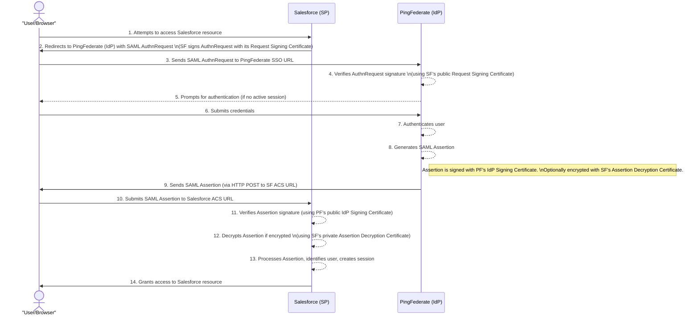
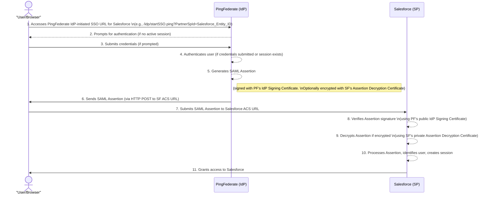

Mermaid sequence diagrams to illustrate the SAML SSO flows between Salesforce (as the Service Provider) and PingFederate (as the Identity Provider).

Here are the diagrams for both SP-Initiated and IdP-Initiated SSO:

### **SP-Initiated SSO Flow**

This flow starts when the user tries to access Salesforce directly.

### **IdP-Initiated SSO Flow**

This flow starts when the user initiates login from PingFederate or a PingFederate-linked portal.

These diagrams should give you a clear visual representation of the SAML SSO processes.

### SP-Initiated SSO Flow (Salesforce to PingFederate)

Here's a breakdown of all steps, with new or clarified details for those not fully covered previously:

* **Step 1: User/Browser \-\>\> SF: Attempts to access Salesforce resource**  
  * The user tries to open a Salesforce page or resource directly in their web browser.  
* **Step 2: SF \-\>\> User/Browser: Redirects to PingFederate (IdP) with SAML AuthnRequest**  
  *  Salesforce, realizing the user isn't logged in, creates a SAML Authentication Request (AuthnRequest). It then sends a redirect instruction to the user's browser, telling it to go to PingFederate's SSO URL with this AuthnRequest. The AuthnRequest may be signed by Salesforce.  
* **Step 3: User/Browser \-\>\> PF: Sends SAML AuthnRequest to PingFederate SSO URL**  
  * The user's browser follows the redirect from Salesforce and sends the SAML AuthnRequest to the specified PingFederate Single Sign-On (SSO) endpoint.  
* **Step 4: PF \--\>\> PF: Verifies AuthnRequest signature**  
  * PingFederate receives the AuthnRequest. If it's signed, PingFederate verifies the signature using Salesforce's public request signing certificate to ensure it came from a trusted Service Provider.  
* **Step 5: PF \--\>\> User/Browser: Prompts for authentication (if no active session)**  
  * If the user doesn't already have an active session with PingFederate, PingFederate presents a login page (or another authentication challenge) to the user's browser.  
* **Step 6: User/Browser \-\>\> PF: Submits credentials**  
  * The user enters their credentials (e.g., username and password) into the PingFederate login page.  
* **Step 7: PF \--\>\> PF: Authenticates user**  
  * PingFederate validates the credentials submitted by the user against its configured identity store (e.g., Active Directory, LDAP).  
* **Step 8: PF \--\>\> PF: Generates SAML Assertion**  
  * Upon successful authentication, PingFederate creates a SAML Assertion. This assertion contains information about the user's identity and authentication status. It is digitally signed by PingFederate's IdP signing certificate. It may also be encrypted for Salesforce.  
* **Step 9: PF \-\>\> User/Browser: Sends SAML Assertion (via HTTP POST to SF ACS URL)**  
  * PingFederate sends the SAML Assertion back to the user's browser. This is typically done via an HTTP POST method, instructing the browser to automatically submit the assertion to Salesforce's Assertion Consumer Service (ACS) URL.  
* **Step 10: User/Browser \-\>\> SF: Submits SAML Assertion to Salesforce ACS URL**  
  * The user's browser automatically POSTs the SAML Assertion received from PingFederate to the Salesforce ACS endpoint.  
* **Step 11: SF \--\>\> SF: Verifies Assertion signature**  
  * Salesforce receives the SAML Assertion and verifies its digital signature using PingFederate's public IdP signing certificate. This confirms the assertion's integrity and authenticity.  
* **Step 12: SF \--\>\> SF: Decrypts Assertion if encrypted**  
  * If the SAML Assertion was encrypted by PingFederate (using Salesforce's public assertion decryption certificate), Salesforce decrypts it using its corresponding private key.  
* **Step 13: SF \--\>\> SF: Processes Assertion, identifies user, creates session**  
  * Salesforce parses the SAML Assertion, extracts the user's identity (e.g., username or Federation ID), maps it to a Salesforce user, and establishes a session for that user.  
* **Step 14: SF \-\>\> User/Browser: Grants access to Salesforce resource**  
  * With a valid session established, Salesforce grants the user access to the initially requested resource or their Salesforce home page.

### IdP-Initiated SSO Flow (PingFederate to Salesforce)

Here's a breakdown of all steps, with new details for those not fully covered previously:

* **Step 1: User/Browser \-\>\> PF: Accesses PingFederate IdP-initiated SSO URL for Salesforce**  
  * The user clicks a link or bookmark that directly initiates login via PingFederate for the Salesforce application (e.g., from an internal portal).  
* **Step 2: PF \--\>\> User/Browser: Prompts for authentication (if no active session)**  
  * If the user doesn't have an active session with PingFederate, PingFederate presents a login page or another authentication challenge.  
* **Step 3: User/Browser \-\>\> PF: Submits credentials (if prompted)**  
  * If prompted, the user enters their credentials into PingFederate's login form.  
* **Step 4: PF \--\>\> PF: Authenticates user (if credentials submitted or session exists)**  
  * PingFederate validates the submitted credentials or confirms an existing session.  
* **Step 5: PF \--\>\> PF: Generates SAML Assertion**  
  * Upon successful authentication (or if a session already exists), PingFederate creates a SAML Assertion for Salesforce, signed with its IdP signing certificate and optionally encrypted.  
* **Step 6: PF \-\>\> User/Browser: Sends SAML Assertion (via HTTP POST to SF ACS URL)**  
  * PingFederate sends the SAML Assertion to the user's browser, typically via an auto-submitting HTTP POST form directed at Salesforce's ACS URL.  
* **Step 7: User/Browser \-\>\> SF: Submits SAML Assertion to Salesforce ACS URL**  
  * The user's browser automatically POSTs the SAML Assertion received from PingFederate to the Salesforce ACS endpoint.  
* **Step 8: SF \--\>\> SF: Verifies Assertion signature**  
  * Salesforce receives the SAML Assertion and verifies its digital signature using PingFederate's public IdP signing certificate.  
* **Step 9: SF \--\>\> SF: Decrypts Assertion if encrypted**  
  * If the SAML Assertion was encrypted, Salesforce decrypts it using its private assertion decryption key.  
* **Step 10: SF \--\>\> SF: Processes Assertion, identifies user, creates session**  
  * Salesforce parses the SAML Assertion, identifies the user, maps them to a Salesforce user account, and establishes a new session.  
* **Step 11: SF \-\>\> User/Browser: Grants access to Salesforce**  
  * Salesforce grants the user access, typically redirecting them to their default landing page within Salesforce.
