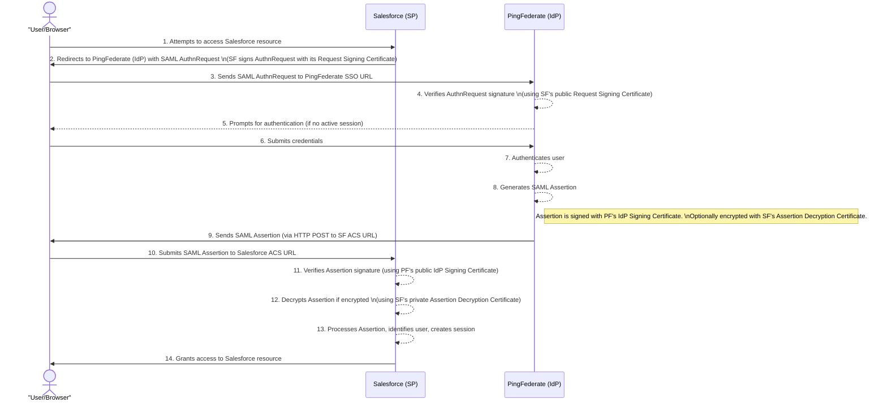
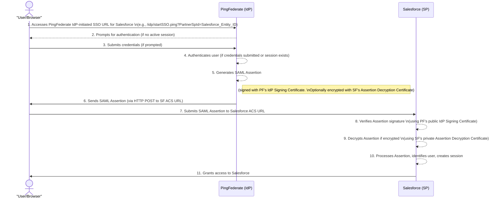

Mermaid sequence diagrams to illustrate the SAML SSO flows between Salesforce (as the Service Provider) and PingFederate (as the Identity Provider).

Here are the diagrams for both SP-Initiated and IdP-Initiated SSO:

### **SP-Initiated SSO Flow**

This flow starts when the user tries to access Salesforce directly.

**Details from the flow** 1**:**

* **Step 2 (SF to User/Browser):** Salesforce initiates the SAML request and redirects the user to PingFederate's Single Sign-On Endpoint URL. The SAML AuthnRequest may be signed by Salesforce's Request Signing Certificate.1  
* **Step 4 (PF):** PingFederate verifies the signature of the SAML AuthnRequest using the Salesforce Request Signing Certificate.1  
* **Step 6 (PF to User/Browser):** PingFederate generates a SAML Response (Assertion) signed with its PingFederate Signing Certificate and directs it to Salesforce's Assertion Consumer Service (ACS) URL via POST.1  
* **Step 8 (SF):** Salesforce verifies the signature of the SAML Response using the PingFederate Signing Certificate.1

### **IdP-Initiated SSO Flow**

This flow starts when the user initiates login from PingFederate or a PingFederate-linked portal.

**Details from the flow** 1**:**

* **Step 1 (User/Browser to PF):** User accesses the PingFederate SSO application endpoint for the Salesforce SP connection (e.g., https://\<your-pingfederate-domain\>/idp/startSSO.ping?PartnerSpId=\<Salesforce-Entity-ID\>).1  
* **Step 5 (PF):** Upon successful authentication, PingFederate generates a SAML assertion signed with the PingFederate Signing Certificate.1  
* **Step 6 (PF to User/Browser):** PingFederate sends this SAML assertion to the Salesforce ACS URL via HTTP POST.1  
* **Step 8 (SF):** Salesforce receives the SAML assertion and verifies the digital signature using the PingFederate Signing Certificate.1

These diagrams should give you a clear visual representation of the SAML SSO processes.
