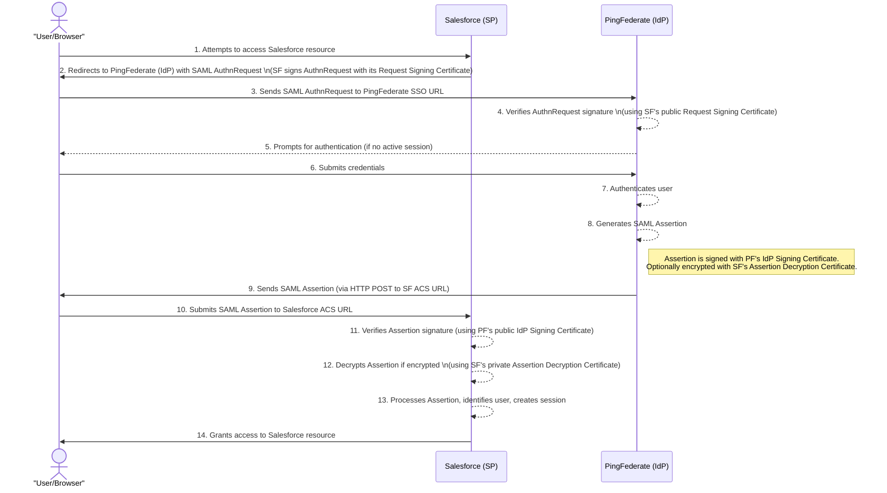
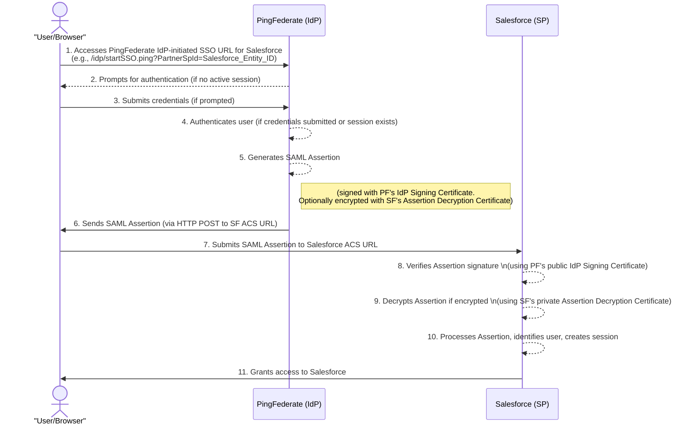

Mermaid sequence diagrams to illustrate the SAML SSO flows between Salesforce (as the Service Provider) and PingFederate (as the Identity Provider).

Here are the diagrams for both SP-Initiated and IdP-Initiated SSO:

### **SP-Initiated SSO Flow**

This flow starts when the user tries to access Salesforce directly.

### **IdP-Initiated SSO Flow**

This flow starts when the user initiates login from PingFederate or a PingFederate-linked portal.

These diagrams should give you a clear visual representation of the SAML SSO processes.

### SP-Initiated SSO Flow (Salesforce to PingFederate)

Here's a breakdown of all steps, with new or clarified details for those not fully covered previously:

* **Step 1: User/Browser \-\>\> SF: Attempts to access Salesforce resource**  
  * The user tries to open a Salesforce page or resource directly in their web browser.  
* **Step 2: SF \-\>\> User/Browser: Redirects to PingFederate (IdP) with SAML AuthnRequest**  
  *  Salesforce, realizing the user isn't logged in, creates a SAML Authentication Request (AuthnRequest). It then sends a redirect instruction to the user's browser, telling it to go to PingFederate's SSO URL with this AuthnRequest. The AuthnRequest may be signed by Salesforce.  
* **Step 3: User/Browser \-\>\> PF: Sends SAML AuthnRequest to PingFederate SSO URL**  
  * The user's browser follows the redirect from Salesforce and sends the SAML AuthnRequest to the specified PingFederate Single Sign-On (SSO) endpoint.  
* **Step 4: PF \--\>\> PF: Verifies AuthnRequest signature**  
  * PingFederate receives the AuthnRequest. If it's signed, PingFederate verifies the signature using Salesforce's public request signing certificate to ensure it came from a trusted Service Provider.  
* **Step 5: PF \--\>\> User/Browser: Prompts for authentication (if no active session)**  
  * If the user doesn't already have an active session with PingFederate, PingFederate presents a login page (or another authentication challenge) to the user's browser.  
* **Step 6: User/Browser \-\>\> PF: Submits credentials**  
  * The user enters their credentials (e.g., username and password) into the PingFederate login page.  
* **Step 7: PF \--\>\> PF: Authenticates user**  
  * PingFederate validates the credentials submitted by the user against its configured identity store (e.g., Active Directory, LDAP).  
* **Step 8: PF \--\>\> PF: Generates SAML Assertion**  
  * Upon successful authentication, PingFederate creates a SAML Assertion. This assertion contains information about the user's identity and authentication status. It is digitally signed by PingFederate's IdP signing certificate. It may also be encrypted for Salesforce.  
* **Step 9: PF \-\>\> User/Browser: Sends SAML Assertion (via HTTP POST to SF ACS URL)**  
  * PingFederate sends the SAML Assertion back to the user's browser. This is typically done via an HTTP POST method, instructing the browser to automatically submit the assertion to Salesforce's Assertion Consumer Service (ACS) URL.  
* **Step 10: User/Browser \-\>\> SF: Submits SAML Assertion to Salesforce ACS URL**  
  * The user's browser automatically POSTs the SAML Assertion received from PingFederate to the Salesforce ACS endpoint.  
* **Step 11: SF \--\>\> SF: Verifies Assertion signature**  
  * Salesforce receives the SAML Assertion and verifies its digital signature using PingFederate's public IdP signing certificate. This confirms the assertion's integrity and authenticity.  
* **Step 12: SF \--\>\> SF: Decrypts Assertion if encrypted**  
  * If the SAML Assertion was encrypted by PingFederate (using Salesforce's public assertion decryption certificate), Salesforce decrypts it using its corresponding private key.  
* **Step 13: SF \--\>\> SF: Processes Assertion, identifies user, creates session**  
  * Salesforce parses the SAML Assertion, extracts the user's identity (e.g., username or Federation ID), maps it to a Salesforce user, and establishes a session for that user.  
* **Step 14: SF \-\>\> User/Browser: Grants access to Salesforce resource**  
  * With a valid session established, Salesforce grants the user access to the initially requested resource or their Salesforce home page.

### IdP-Initiated SSO Flow (PingFederate to Salesforce)

Here's a breakdown of all steps, with new details for those not fully covered previously:

* **Step 1: User/Browser \-\>\> PF: Accesses PingFederate IdP-initiated SSO URL for Salesforce**  
  * The user clicks a link or bookmark that directly initiates login via PingFederate for the Salesforce application (e.g., from an internal portal).  
* **Step 2: PF \--\>\> User/Browser: Prompts for authentication (if no active session)**  
  * If the user doesn't have an active session with PingFederate, PingFederate presents a login page or another authentication challenge.  
* **Step 3: User/Browser \-\>\> PF: Submits credentials (if prompted)**  
  * If prompted, the user enters their credentials into PingFederate's login form.  
* **Step 4: PF \--\>\> PF: Authenticates user (if credentials submitted or session exists)**  
  * PingFederate validates the submitted credentials or confirms an existing session.  
* **Step 5: PF \--\>\> PF: Generates SAML Assertion**  
  * Upon successful authentication (or if a session already exists), PingFederate creates a SAML Assertion for Salesforce, signed with its IdP signing certificate and optionally encrypted.  
* **Step 6: PF \-\>\> User/Browser: Sends SAML Assertion (via HTTP POST to SF ACS URL)**  
  * PingFederate sends the SAML Assertion to the user's browser, typically via an auto-submitting HTTP POST form directed at Salesforce's ACS URL.  
* **Step 7: User/Browser \-\>\> SF: Submits SAML Assertion to Salesforce ACS URL**  
  * The user's browser automatically POSTs the SAML Assertion received from PingFederate to the Salesforce ACS endpoint.  
* **Step 8: SF \--\>\> SF: Verifies Assertion signature**  
  * Salesforce receives the SAML Assertion and verifies its digital signature using PingFederate's public IdP signing certificate.  
* **Step 9: SF \--\>\> SF: Decrypts Assertion if encrypted**  
  * If the SAML Assertion was encrypted, Salesforce decrypts it using its private assertion decryption key.  
* **Step 10: SF \--\>\> SF: Processes Assertion, identifies user, creates session**  
  * Salesforce parses the SAML Assertion, identifies the user, maps them to a Salesforce user account, and establishes a new session.  
* **Step 11: SF \-\>\> User/Browser: Grants access to Salesforce**  
  * Salesforce grants the user access, typically redirecting them to their default landing page within Salesforce.
 
Okay, this is a great request for adding more practical detail\! Here's a breakdown of each step for both SAML SSO flows, including examples of URL formats and the typical locations and uses of the certificates involved.

**Important Notes Before We Start:**

* **Placeholders:** URLs will use placeholders like https://\<your-salesforce-domain\>.my.salesforce.com, https://\<pf-idp-hostname.example.com\>, and PartnerSpId=\<Salesforce\_Entity\_ID\>. You'll need to replace these with your actual configured values.  
* **HTTPS/TLS Certificates:** All communication should be over HTTPS. This means both Salesforce and PingFederate will have their own HTTPS/TLS certificates to secure the browser-to-server connections. These are standard web server certificates and are distinct from the SAML-specific signing and encryption certificates.  
  * **Location:** Server-side (Salesforce or PingFederate). Private keys are on the server; public keys (and their chains) are presented to the browser for validation.  
* **SAML Certificates:**  
  * **Signing Certificates:** Used to create digital signatures on SAML messages (AuthnRequest, Assertion) to ensure integrity and authenticity.  
    * Private Key: Held by the signing entity (e.g., Salesforce for AuthnRequest, PingFederate for Assertion). Stored securely on the respective platform.  
    * Public Key: Shared with the verifying entity. Stored in the verifying entity's trust configuration (e.g., PingFederate has Salesforce's public key; Salesforce has PingFederate's public key).  
  * **Encryption Certificates:** Used to encrypt SAML Assertions (or parts of them) to ensure confidentiality.  
    * Public Key: Held by the encrypting entity (e.g., PingFederate uses Salesforce's public encryption key).  
    * Private Key: Held by the decrypting entity (e.g., Salesforce uses its private decryption key). Stored securely on the platform.  
* **Metadata Exchange:** The most common and recommended way to exchange public certificates, entity IDs, and endpoint URLs is by exchanging SAML 2.0 metadata files between Salesforce and PingFederate.

### ---

# SP-Initiated SSO Flow (Salesforce to PingFederate)

This flow starts when the user tries to access Salesforce directly.

**Step 1: User/Browser \-\>\> SF: Attempts to access Salesforce resource**

* **URL Example:**  
  * https://\<your-salesforce-domain\>.my.salesforce.com/ (Salesforce org)  
  * https://\<your-salesforce-domain\>.lightning.force.com/lightning/page/home (Lightning Experience)  
  * https://\<your-community-domain\>.com/s/ (Experience Cloud site)  
* **Certificates:**  
  * **Salesforce HTTPS/TLS Certificate:** Secures the connection between the browser and Salesforce.

**Step 2: SF \-\>\> User/Browser: Redirects to PingFederate (IdP) with SAML AuthnRequest**

* **URL Format (Browser is redirected to PingFederate's SSO endpoint using HTTP-Redirect Binding):** https://\<pf-idp-hostname.example.com\>/idp/SSO.saml2 ?SAMLRequest=\<Base64URLEncoded\_Deflated\_AuthnRequest\> \&RelayState=\<URLEncoded\_Opaque\_Value\_or\_TargetURL\> \&SigAlg=\<URLEncoded\_SignatureAlgorithmURI\> (e.g., http%3A%2F%2Fwww.w3.org%2F2001%2F04%2Fxmldsig-more%23rsa-sha256) \&Signature=\<Base64URLEncoded\_Signature\>  
* **Certificates:**  
  * **Salesforce Request Signing Certificate (Private Key):** Used by Salesforce to sign the AuthnRequest.  
    * **Location:** Managed in Salesforce under "Certificate and Key Management." The specific certificate is selected in the Salesforce "Single Sign-On Settings" for the PingFederate configuration.  
  * **Salesforce HTTPS/TLS Certificate:** Secures the redirect response to the browser.

**Step 3: User/Browser \-\>\> PF: Sends SAML AuthnRequest to PingFederate SSO URL**

* **URL Example (Browser navigates to the URL from Step 2):** https://\<pf-idp-hostname.example.com\>/idp/SSO.saml2?SAMLRequest=...\&RelayState=...\&SigAlg=...\&Signature=...  
* **Certificates:**  
  * **PingFederate HTTPS/TLS Certificate:** Secures the connection between the browser and PingFederate.

**Step 4: PF \--\>\> PF: Verifies AuthnRequest signature**

* **URL Example:** N/A (internal PingFederate process).  
* **Certificates:**  
  * **Salesforce Request Signing Certificate (Public Key):** Used by PingFederate to verify the signature of the AuthnRequest.  
    * **Location:** Stored in PingFederate's configuration for the Salesforce SP Connection. Typically uploaded from Salesforce metadata or as a separate certificate file (.crt, .cer).

**Step 5: PF \--\>\> User/Browser: Prompts for authentication (if no active session)**

* **URL Example (PingFederate's login page, path can vary):** https://\<pf-idp-hostname.example.com\>/pf/adapter/UsernamePasswordLogin.form https://\<pf-idp-hostname.example.com\>/idp/resumeSAML2Flow.ping (intermediate PingFederate flow URL)  
* **Certificates:**  
  * **PingFederate HTTPS/TLS Certificate:** Secures the login page served to the browser.

**Step 6: User/Browser \-\>\> PF: Submits credentials**

* **URL Example (Form POST to PingFederate's authentication handler):** https://\<pf-idp-hostname.example.com\>/pf/adapter/UsernamePasswordLogin.form (or the action URL of the login form)  
* **Certificates:**  
  * **PingFederate HTTPS/TLS Certificate:** Secures the submission of credentials from the browser.

**Step 7: PF \--\>\> PF: Authenticates user**

* **URL Example:** N/A (internal PingFederate process). May involve internal calls to identity stores like:  
  * LDAP: ldap://\<ldap-server\>:\<port\> or ldaps://\<ldap-server\>:\<port\>  
  * Database: JDBC connection strings.  
* **Certificates:**  
  * If PingFederate connects to backend stores via secure protocols (e.g., LDAPS), PingFederate's truststore might need the CA certificate for the LDAP server's certificate, or client certificates if mutual authentication is used.

**Step 8: PF \--\>\> PF: Generates SAML Assertion**

* **URL Example:** N/A (internal PingFederate process).  
* **Certificates:**  
  * **PingFederate IdP Signing Certificate (Private Key):** Used by PingFederate to sign the SAML Assertion.  
    * **Location:** Managed within PingFederate's certificate management (e.g., "Signing & Decryption Keys"). Selected in the IdP Adapter or SP Connection settings.  
  * **(Optional) Salesforce Assertion Encryption Certificate (Public Key):** If assertion encryption is enabled, PingFederate uses this to encrypt the assertion.  
    * **Location:** Stored in PingFederate's configuration for the Salesforce SP Connection. Obtained from Salesforce metadata (usually labeled as "encryption" usage).

**Step 9: PF \-\>\> User/Browser: Sends SAML Assertion (via HTTP POST to SF ACS URL)**

* The browser is on a PingFederate page (e.g., https://\<pf-idp-hostname.example.com\>/idp/SAML2AssertionConsumer) that contains an auto-submitting HTML form.  
* **Form Action URL (Salesforce ACS URL):** https://\<your-salesforce-domain\>.my.salesforce.com/saml/SSO (This is the Salesforce default. It can vary for communities or custom configurations).  
* **Form Parameters:** SAMLResponse (Base64 encoded SAML Assertion), RelayState.  
* **Certificates:**  
  * **PingFederate HTTPS/TLS Certificate:** Secures the PingFederate page serving the auto-POST form.  
  * The SAML Assertion within the SAMLResponse is already signed (and possibly encrypted) using certificates from Step 8\.

**Step 10: User/Browser \-\>\> SF: Submits SAML Assertion to Salesforce ACS URL**

* **URL Example (Salesforce Assertion Consumer Service URL):**  
  * Default: https://\<your-salesforce-domain\>.my.salesforce.com/saml/SSO  
  * Communities/Portals: https://\<your-community-domain\>/saml/SSO or https://\<your-salesforce-domain\>.my.salesforce.com/\<community\_url\_path\>/saml/SSO  
  * This URL is specified in Salesforce's SAML configuration and its metadata.  
* **Certificates:**  
  * **Salesforce HTTPS/TLS Certificate:** Secures the connection for the browser POSTing the assertion to Salesforce.

**Step 11: SF \--\>\> SF: Verifies Assertion signature**

* **URL Example:** N/A (internal Salesforce process).  
* **Certificates:**  
  * **PingFederate IdP Signing Certificate (Public Key):** Used by Salesforce to verify the signature of the SAML Assertion.  
    * **Location:** Uploaded to Salesforce in the "Single Sign-On Settings" for the PingFederate IdP configuration. Obtained from PingFederate metadata or as a certificate file.

**Step 12: SF \--\>\> SF: Decrypts Assertion if encrypted**

* **URL Example:** N/A (internal Salesforce process).  
* **Certificates:**  
  * **Salesforce Assertion Encryption Certificate (Private Key):** Used by Salesforce to decrypt the encrypted assertion.  
    * **Location:** Managed in Salesforce under "Certificate and Key Management." This is the private key corresponding to the public encryption certificate PingFederate used in Step 8\.

**Step 13: SF \--\>\> SF: Processes Assertion, identifies user, creates session**

* **URL Example:** N/A (internal Salesforce process).  
* **Certificates:** None directly involved in this processing logic, but rely on successful prior certificate operations.

**Step 14: SF \-\>\> User/Browser: Grants access to Salesforce resource**

* **URL Example (Target resource or default landing page):**  
  * RelayState URL from Step 2 if provided.  
  * https://\<your-salesforce-domain\>.lightning.force.com/  
* **Certificates:**  
  * **Salesforce HTTPS/TLS Certificate:** Secures the Salesforce page served to the browser.

### ---

# IdP-Initiated SSO Flow (PingFederate to Salesforce)

This flow starts when the user initiates login from PingFederate or a PingFederate-linked portal.

**Step 1: User/Browser \-\>\> PF: Accesses PingFederate IdP-initiated SSO URL for Salesforce**

* **URL Example:** https://\<pf-idp-hostname.example.com\>/idp/startSSO.ping?PartnerSpId=\<Salesforce\_Entity\_ID\_for\_PF\>  
  * \<Salesforce\_Entity\_ID\_for\_PF\> is the identifier for the Salesforce SP connection configured in PingFederate (e.g., https://\<your-salesforce-domain\>.my.salesforce.com or a custom URN).  
* **Certificates:**  
  * **PingFederate HTTPS/TLS Certificate:** Secures the connection.

**Step 2: PF \--\>\> User/Browser: Prompts for authentication (if no active session)**

* **URL Example (PingFederate's login page):** https://\<pf-idp-hostname.example.com\>/pf/adapter/UsernamePasswordLogin.form  
* **Certificates:**  
  * **PingFederate HTTPS/TLS Certificate:** Secures the login page.

**Step 3: User/Browser \-\>\> PF: Submits credentials (if prompted)**

* **URL Example (POST to PingFederate's authentication handler):** https://\<pf-idp-hostname.example.com\>/pf/adapter/UsernamePasswordLogin.form  
* **Certificates:**  
  * **PingFederate HTTPS/TLS Certificate:** Secures credential submission.

**Step 4: PF \--\>\> PF: Authenticates user (if credentials submitted or session exists)**

* **URL Example:** N/A (internal PingFederate process).  
* **Certificates:** (Same as SP-Initiated Step 7\) Potential use of certificates for secure backend connections.

**Step 5: PF \--\>\> PF: Generates SAML Assertion**

* **URL Example:** N/A (internal PingFederate process).  
* **Certificates:**  
  * **PingFederate IdP Signing Certificate (Private Key):** (Same as SP-Initiated Step 8\) To sign the assertion. Location: PingFederate.  
  * **(Optional) Salesforce Assertion Encryption Certificate (Public Key):** (Same as SP-Initiated Step 8\) To encrypt the assertion. Location: PingFederate (obtained from Salesforce).

**Step 6: PF \-\>\> User/Browser: Sends SAML Assertion (via HTTP POST to SF ACS URL)**

* Similar to SP-Initiated Step 9\. Browser is on a PingFederate page with an auto-submitting form.  
* **Form Action URL (Salesforce ACS URL):** https://\<your-salesforce-domain\>.my.salesforce.com/saml/SSO (or the ACS URL configured in PingFederate for this Salesforce SP connection).  
* **Form Parameters:** SAMLResponse, RelayState (optional, can be configured in PingFederate for IdP-initiated to specify a landing page in Salesforce).  
* **Certificates:**  
  * **PingFederate HTTPS/TLS Certificate.** Assertion itself is already processed with SAML certs.

**Step 7: User/Browser \-\>\> SF: Submits SAML Assertion to Salesforce ACS URL**

* **URL Example (Salesforce ACS URL):** https://\<your-salesforce-domain\>.my.salesforce.com/saml/SSO  
* **Certificates:**  
  * **Salesforce HTTPS/TLS Certificate.**

**Step 8: SF \--\>\> SF: Verifies Assertion signature**

* **URL Example:** N/A (internal Salesforce process).  
* **Certificates:**  
  * **PingFederate IdP Signing Certificate (Public Key):** (Same as SP-Initiated Step 11\) To verify assertion signature. Location: Salesforce.

**Step 9: SF \--\>\> SF: Decrypts Assertion if encrypted**

* **URL Example:** N/A (internal Salesforce process).  
* **Certificates:**  
  * **Salesforce Assertion Encryption Certificate (Private Key):** (Same as SP-Initiated Step 12\) To decrypt the assertion. Location: Salesforce.

**Step 10: SF \--\>\> SF: Processes Assertion, identifies user, creates session**

* **URL Example:** N/A (internal Salesforce process).  
* **Certificates:** None for this specific sub-step.

**Step 11: SF \-\>\> User/Browser: Grants access to Salesforce**

* **URL Example (Default Salesforce landing page or IdP-initiated start URL specified by RelayState or IdP config):** https://\<your-salesforce-domain\>.lightning.force.com/  
* **Certificates:**  
  * **Salesforce HTTPS/TLS Certificate.**

This detailed breakdown should give you a much clearer picture of the URLs and certificate usage at each stage of the SAML SSO flows between Salesforce and PingFederate.
