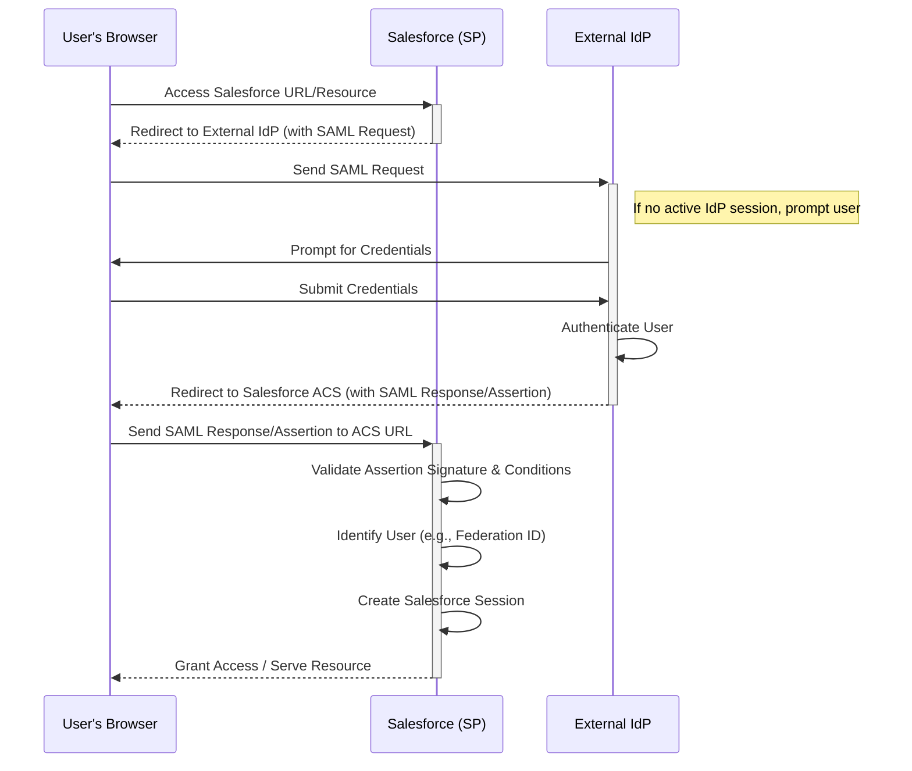
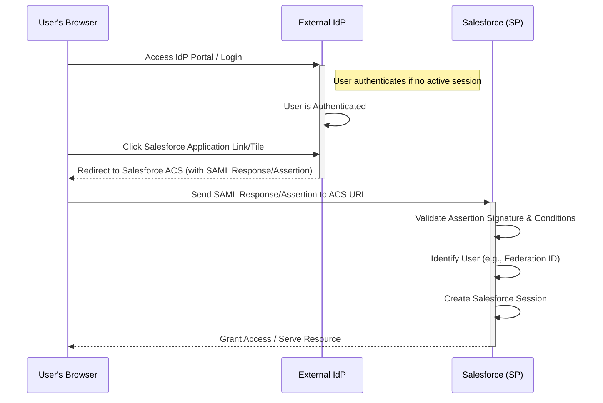
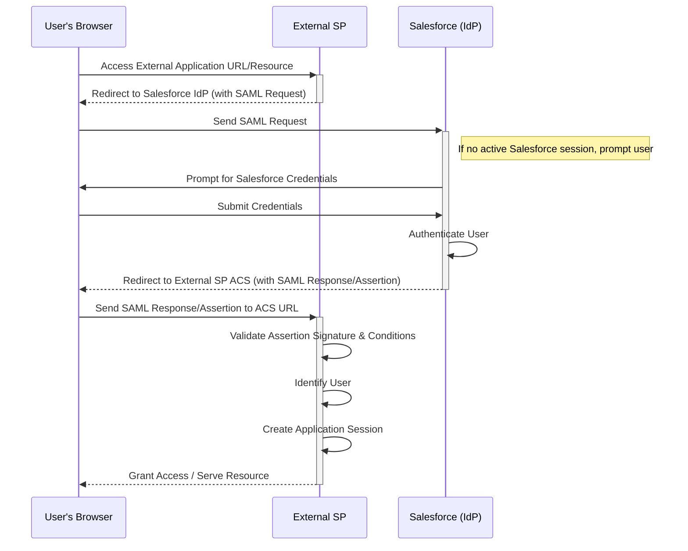
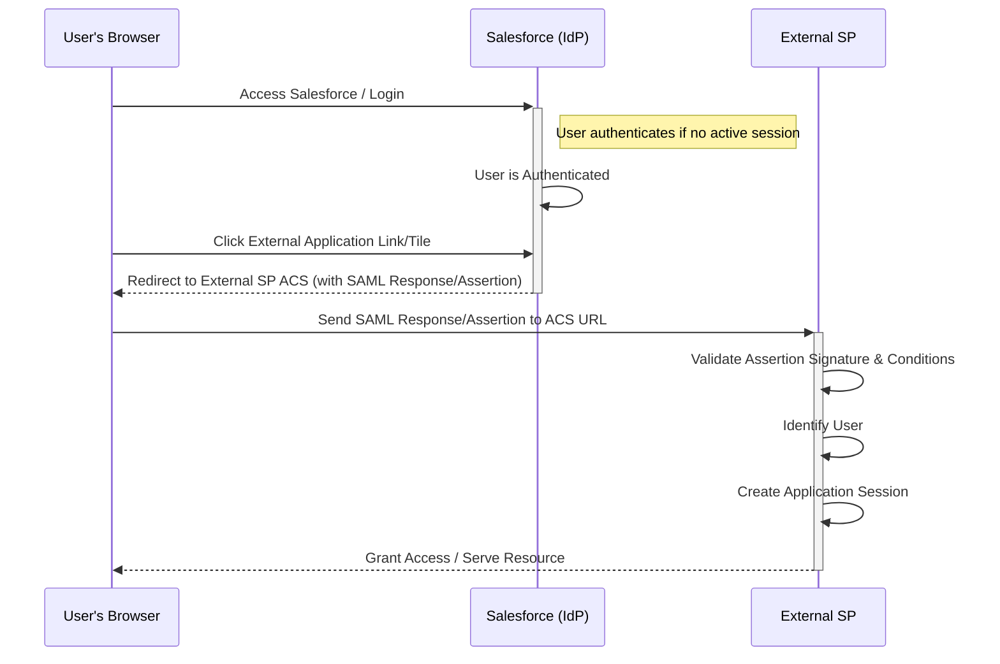
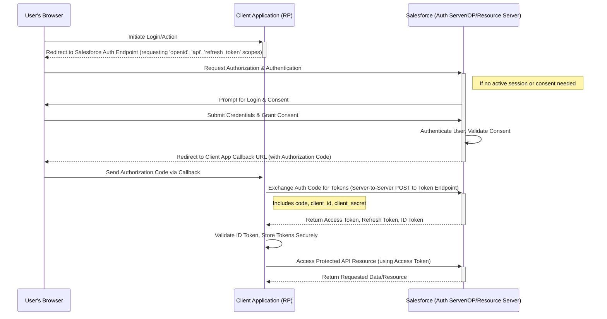

Here are the sequence diagrams for the different SAML and OAuth 2.0 \+ OpenID Connect scenarios:

**1\. SAML: SP-Initiated Flow (Salesforce as SP, External IdP)**

This flow starts when the user tries to access Salesforce directly.

**2\. SAML: IdP-Initiated Flow (Salesforce as SP, External IdP)**

This flow starts when the user is already logged into the external IdP's portal and clicks a link to access Salesforce.

**3\. SAML: SP-Initiated Flow (External SP, Salesforce as IdP)**

This flow starts when the user tries to access an external application that uses Salesforce for authentication.

**4\. SAML: IdP-Initiated Flow (External SP, Salesforce as IdP)**

This flow starts when the user is logged into Salesforce and clicks a link (e.g., in the App Launcher) to access an integrated external application.

**5\. OAuth 2.0 \+ OpenID Connect (Authorization Code Flow)**

This is the standard flow for web applications using OIDC for authentication and OAuth 2.0 for authorization, often initiated when a user clicks "Log in with Salesforce".

